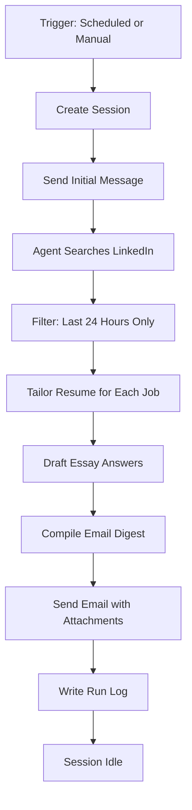

# Agent Configuration Guide

This document explains how to update and manage the Managed Agent configuration.

## Overview

The job search agent runs in two modes:
- **Scheduled**: Automatically via GitHub Actions on Wed/Fri/Sat/Sun at 8 AM and 5 PM ET
- **Ad-hoc**: Manually triggered from IntelliJ or command line

## Running the Agent

### Manual Trigger (Ad-hoc)

From the project directory:

```powershell
# Activate virtual environment
.\.venv\Scripts\Activate.ps1

# Run trigger script
python .\scripts\trigger_session.py
```

Or from IntelliJ:
1. Open `trigger_session.py`
2. Right-click → Run 'trigger_session'
3. Monitor console output for session progress

### Test the Updated Script

```powershell
cd C:\Users\sawan\Downloads\tailoring_resume
.\.venv\Scripts\python.exe .\agent\trigger_session.py
```

Expected output:
```
✓ Session created: sesn_...
→ Sending initial message: Run the twice-daily LinkedIn job search...
✓ Initial message sent. Streaming session events...
[1] session.status_active: ...
[2] message.created: ...
...
✓ Session completed and is now idle.
```

## Schedule Configuration

The agent runs on this schedule via GitHub Actions:

| Day | Times | UTC (Standard) | UTC (DST) |
|-----|-------|----------------|-----------|
| Wednesday | 8 AM, 5 PM ET | 13:00, 22:00 | 12:00, 21:00 |
| Friday | 8 AM, 5 PM ET | 13:00, 22:00 | 12:00, 21:00 |
| Saturday | 8 AM, 5 PM ET | 13:00, 22:00 | 12:00, 21:00 |
| Sunday | 8 AM, 5 PM ET | 13:00, 22:00 | 12:00, 21:00 |

**Note**: The GitHub Actions workflow uses UTC times. During Daylight Saving Time (March-November), the cron schedule in `.github/workflows/managed-agent-cron.yml` may need adjustment.

## Workflow


