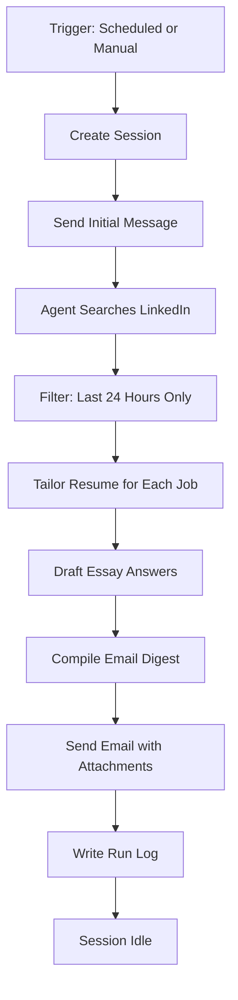

# Agent Configuration Guide

This document explains how to update and manage the Managed Agent configuration.

## Overview

The job search agent runs in two modes:
- **Scheduled**: Automatically via GitHub Actions on Wed/Fri/Sat/Sun at 8 AM and 5 PM ET
- **Ad-hoc**: Manually triggered from IntelliJ or command line

## Updating the Agent System Prompt

The agent's system prompt (instructions) is stored in the Anthropic Managed Agents service. To update it:

### Option 1: Via Anthropic Console (Recommended)

1. Go to [Anthropic Console](https://console.anthropic.com/)
2. Navigate to **Managed Agents** section
3. Locate the agent: **Resume & CV Tailoring + Job Search Agent** (ID: `agent_011CaSWBYohyTtssbr3xEg6k`)
4. Click **Edit** or **Configure**
5. Replace the **System Prompt** with the contents of `agent/system_prompt.txt`
6. Save the changes

### Option 2: Via API (Advanced)

Use the Anthropic API to update the agent programmatically:

```bash
curl -X PATCH https://api.anthropic.com/v1/agents/{agent_id} \
  -H "x-api-key: $ANTHROPIC_API_KEY" \
  -H "anthropic-version: 2023-06-01" \
  -H "anthropic-beta: managed-agents-2026-04-01" \
  -H "Content-Type: application/json" \
  -d @- <<EOF
{
  "system": "$(cat agent/system_prompt.txt)"
}
EOF
```

## Running the Agent

### Manual Trigger (Ad-hoc)

From the project directory:

```powershell
# Activate virtual environment
.\.venv\Scripts\Activate.ps1

# Run trigger script
python .\scripts\trigger_session.py
```

Or from IntelliJ:
1. Open `trigger_session.py`
2. Right-click → Run 'trigger_session'
3. Monitor console output for session progress

### Test the Updated Script

```powershell
cd C:\Users\sawan\Downloads\tailoring_resume
.\.venv\Scripts\python.exe .\agent\trigger_session.py
```

Expected output:
```
✓ Session created: sesn_...
→ Sending initial message: Run the twice-daily LinkedIn job search...
✓ Initial message sent. Streaming session events...
[1] session.status_active: ...
[2] message.created: ...
...
✓ Session completed and is now idle.
```

## Schedule Configuration

The agent runs on this schedule via GitHub Actions:

| Day | Times | UTC (Standard) | UTC (DST) |
|-----|-------|----------------|-----------|
| Wednesday | 8 AM, 5 PM ET | 13:00, 22:00 | 12:00, 21:00 |
| Friday | 8 AM, 5 PM ET | 13:00, 22:00 | 12:00, 21:00 |
| Saturday | 8 AM, 5 PM ET | 13:00, 22:00 | 12:00, 21:00 |
| Sunday | 8 AM, 5 PM ET | 13:00, 22:00 | 12:00, 21:00 |

**Note**: The GitHub Actions workflow uses UTC times. During Daylight Saving Time (March-November), the cron schedule in `.github/workflows/managed-agent-cron.yml` may need adjustment.

### Adjusting Schedule for DST

Edit `.github/workflows/managed-agent-cron.yml`:

```yaml
on:
  schedule:
    # Standard Time (November - March): 13:00 and 22:00 UTC
    - cron: "0 13,22 * * 0,3,5,6"
    
    # Daylight Saving Time (March - November): 12:00 and 21:00 UTC
    # Uncomment and switch during DST:
    # - cron: "0 12,21 * * 0,3,5,6"
```

## Required Secrets

Ensure these GitHub Secrets are configured in the repository:

| Secret Name | Description | Example Value |
|-------------|-------------|---------------|
| `ANTHROPIC_API_KEY` | Your Anthropic API key | `sk-ant-api03-...` |
| `MANAGED_AGENT_ID` | Your agent ID | `agent_011CaSWBYo...` |
| `SESSION_ENVIRONMENT_ID` | Environment ID | `env_01S2uLuohL...` |
| `VAULT_IDS` | Vault ID for retrieval | `vlt_011CawoFJf...` |
| `SESSION_INPUT` | Default prompt | `Run the twice-daily...` |
| `MANAGED_AGENTS_BASE_URL` | API base URL (optional) | `https://api.anthropic.com` |

### Setting Secrets

1. Go to the GitHub repository
2. Navigate to **Settings** → **Secrets and variables** → **Actions**
3. Click **New repository secret**
4. Add each secret from the table above

## Key Updates in Latest Version

### Changes to Agent Prompt (`agent_system_prompt.txt`)

1. **24-Hour Recency Filter**: Only jobs posted within last 24 hours
2. **Email Sending**: Must use Gmail MCP `send` tool, not `create_draft`
3. **Resume Attachments**: Attach or embed all generated resume files
4. **Trigger Type Logging**: Log whether run was ad-hoc or scheduled
5. **Action-Verb Bullets**: Resume bullets start with strong verbs, no "I" or "For...I"

### Changes to `trigger_session.py`

1. **Initial Message**: Now sends `user.message` event to start the workflow
2. **Event Streaming**: Monitors session progress in real-time
3. **Better Logging**: Clear progress indicators and event counts

### Changes to Resume Rules (`rules/resume_rules.txt`)

1. **Bullet Point Style**: Action-oriented format without first-person pronouns
2. **Template Examples**: Updated to show proper format

## Troubleshooting

### Session Not Starting

**Problem**: Session created but shows 0 tokens, no activity  
**Solution**: The updated `trigger_session.py` now sends an initial message. Ensure the latest version is being used.

### Agent Not Following New Instructions

**Problem**: Agent still using old behavior  
**Solution**: Update the system prompt in Anthropic Console (see "Updating the Agent System Prompt" above)

### GitHub Actions Failing

**Problem**: Workflow fails with import errors  
**Solution**: Verify `.github/workflows/managed-agent-cron.yml` installs both `python-dotenv` and `anthropic`

### Resume Files Not Received

**Problem**: Email arrives but no resume attachments/content  
**Solution**: Verify agent has `/mnt/session/outputs/` write access and Gmail MCP is properly configured

## Email Digest Format

Each run sends an email to `sawan.dasari@gmail.com` with:

```
Subject: Job Search Digest — [DATE] [TIME] Run

Body:
=============================================
JOB SEARCH DIGEST
Run Type: [Ad-hoc / Scheduled]
Date: [Date and Time]
=============================================

JOBS FOUND (5-7):

1. [Job Title] | [Company]
   Location: [City, State / Remote]
   Posted: [Post Date/Time]
   Easy Apply: [Yes/No]
   URL: [LinkedIn URL]
   Sponsorship: [OK / NO SPONSORSHIP WARNING]
   
   Requirements: [Brief summary]
   
   [Essay answers if applicable]

2. [Next job...]

=============================================
RESUME FILES ATTACHED:
- Company_Role_resume.txt
- [Additional resumes...]

OR (if attachments not supported):

=== RESUME: Company_Role ===
[Full resume text]
=============================================
```

## File Structure

```
tailoring_resume/
├── agent_system_prompt.txt          # Latest agent instructions
├── AGENT_SETUP.md                   # This file
├── .env                            # Local environment variables
├── .github/workflows/
│   └── managed-agent-cron.yml      # Scheduled workflow
├── agent/
│   ├── trigger_session.py          # Session trigger script
│   └── system_prompt.txt           # Agent instructions
├── local/
│   ├── tailor_resume.py            # Manual tailoring script
│   ├── inputs/
│   │   ├── job_description.txt
│   │   └── Sawan_Dasari_Resume.docx
│   ├── output/
│   │   └── [Generated tailored resumes]
│   └── rules/
│       └── resume_rules.txt        # Resume formatting rules
└── docs/
    ├── AGENT_SETUP.md
    └── [Other documentation]
```

## Workflow



## Support

When encountering issues:
1. Check `.env` file has all required keys
2. Verify GitHub Secrets are set correctly
3. Review session output for error messages
4. Check Anthropic Console for agent configuration
5. Ensure trigger_session.py has latest code with event streaming

---

**Last Updated**: May 13, 2026  
**Agent Version**: 7  
**Agent ID**: `agent_011CaSWBYohyTtssbr3xEg6k`

